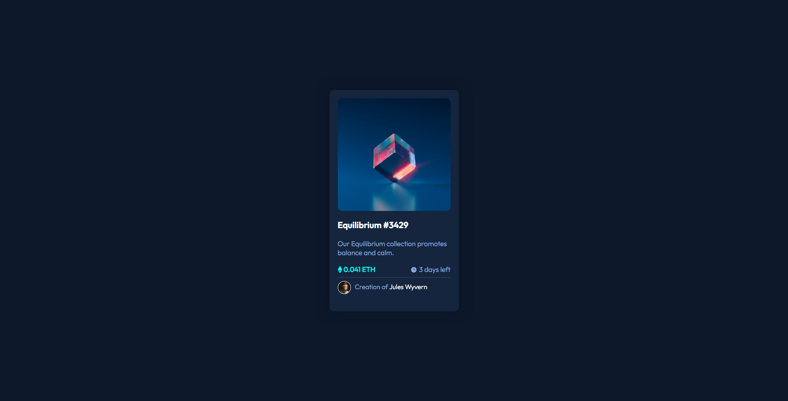

# Frontend Mentor - NFT preview card component solution

This is a solution to the [NFT preview card component challenge on Frontend Mentor](https://www.frontendmentor.io/challenges/nft-preview-card-component-SbdUL_w0U). Frontend Mentor challenges help you improve your coding skills by building realistic projects. 

## Table of contents

- [Overview](#overview)
  - [The challenge](#the-challenge)
  - [Screenshot](#screenshot)
  - [Links](#links)
- [My process](#my-process)
  - [Built with](#built-with)
  - [What I learned](#what-i-learned)
  - [Continued development](#continued-development)
  - [Useful resources](#useful-resources)

**Note: Delete this note and update the table of contents based on what sections you keep.**

## Overview

### The challenge

Users should be able to:

- View the optimal layout depending on their device's screen size
- See hover states for interactive elements

### Screenshot



### Links

- Solution URL: [Frontend Mentor Page](https://www.frontendmentor.io/challenges/nft-preview-card-component-SbdUL_w0U/)
- Live Site URL: [My solution](https://purplejragon.github.io/nft-preview-card-component/)

## My process

### Built with

- HTML5 markup
- CSS styling

### What I learned

I learned how to center a div both ways. 
```css
.card {
  position: absolute;
  top: 50%;
  left: 50%;
  transform: translate(-50%, -50%);
  ...
}
```

### Continued development

I still want to get better at writing clean CSS code, and hard coding less values.

### Useful resources

- [Fireship](https://www.youtube.com/c/Fireship) - Fireship.io helped me to learn how to center a div, and also helped me make my CSS a little bit cleaner.